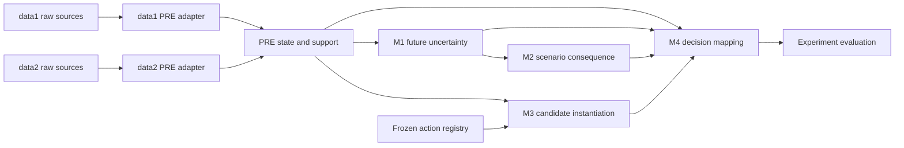

# Contract: Downstream Boundaries (Placeholders Only)

This document prevents foundation implementation from crossing into algorithm development. It does
not define executable prediction, consequence, action, or ranking behavior.

## Dependency Map



The graph describes future scientific inputs, not implementation authorized in this feature.

## M1 Boundary

Future M1 consumes only PRE-qualified historical values, masks, ages, evidence/support, operational
stage, and supported timing references. It never reads raw data. This milestone creates only a README
that lists the contract and reports `IMPLEMENTATION_STATUS = NOT_IMPLEMENTED_BY_SCOPE`.

## M2 Boundary

Future M2 consumes M1 aligned scenarios, PRE context, and supported references/proxies. It never reads
future realized outcomes during formal inference. No consequence ontology code or valuation parameter
is implemented in this milestone.

## M3 Boundary (Confirmed)

Future M3 instantiates candidate action contracts from:

```text
PRE current episode state
+ frozen action-template registry
```

M3 does not require the M2 scenario output as a sequential input and does not rank actions. Crew, gate,
slot, standby, OCC resource, and action-response history remain explicitly unsupported/scenario-only
when not evidenced. This milestone does not create the action registry or candidate logic beyond this
boundary statement.

## M4 Boundary (Confirmed)

Future M4 receives:

```text
PRE state/support
+ M1 aligned uncertainty
+ M2 scenario-level consequence
+ M3 candidate actions
```

It later assigns lanes and performs decision mapping. It never reads raw/canonical dataset fields.
No lanes, opportunity calculation, residual-risk score, A00 identity, or ranking code is implemented
in this milestone.

## Experiment Boundary

Experiment directories are documentation placeholders. They contain no runner, evaluation metric,
LLM integration, robustness grid, output, or claim. Evaluation cannot modify formal contracts or
outputs.

## Static Rules

- `model` cannot import `exp`.
- M1-M4 cannot import dataset-specific adapter modules or raw field definitions.
- PRE cannot import M1-M4 or experiments.
- M3 cannot import M2 scenario/consequence implementation.
- M4 may eventually import only public contracts from PRE/M1/M2/M3, never their dataset internals.
- No placeholder can return a fabricated successful result; if callable, it raises a typed
  `NOT_IMPLEMENTED_BY_SCOPE` error.
