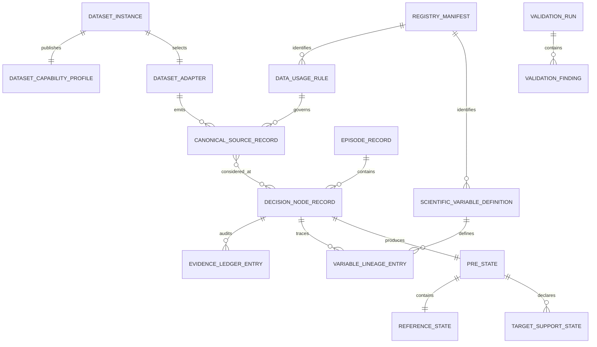

# Data Model: Executable Scientific Foundation

**Feature**: [spec.md](spec.md)  
**Contract scope**: Adapters, PRE skeleton, registries, lineage/evidence, validation  
**Excluded**: M1-M4 numerical objects and experiment results

## Conventions

- All identifiers are non-empty stable strings; generated identifiers use deterministic SHA-256.
- All timestamps are timezone-aware UTC. Local source times are invalid until an adapter converts them.
- Durations use minutes unless a field explicitly ends in `_seconds`.
- Enums serialize as their canonical uppercase string.
- Contracts are immutable after validation. A changed input creates a new object and identity.
- Scientific values use a `SupportedValue` envelope. `null` is not interchangeable with zero.
- Every contract carries `schema_version`; registries additionally carry semantic `registry_version`.

## Canonical Enums

### AvailabilityBasis

`OBSERVED_AVAILABILITY`, `REPLAY_EVENT_TIME`, `SCHEDULE_REFERENCE_ASSUMPTION`,
`ARCHIVE_PUBLICATION_RULE`, `REFERENCE_PERIOD`, `POSTHOC_ONLY`, `UNAVAILABLE`.

### DecisionTimeRole

`EPISODE_CONSTRUCTION`, `INFERENCE_EVIDENCE`, `FROZEN_REFERENCE`, `TRAIN_LABEL`,
`EVAL_OUTCOME`, `REPLAY_ASSUMPTION`, `SCENARIO_ONLY`, `UNSUPPORTED`.

### EvidenceClass

Ordered support ceiling from stronger factual grounding to no formal support, without implying that
all entries are directly comparable: `DIRECT`, `DERIVED`, `DOMAIN_PROXY`, `EMPIRICAL_REFERENCE`,
`EXTERNAL_STANDARD`, `SCENARIO_PARAMETER`, `UNSUPPORTED`.

### SupportState

`SUPPORTED`, `DEGRADED`, `ABSTAIN`.

### FreezeState

`FROZEN`, `DEVELOPMENT_FROZEN`, `UNSUPPORTED`.

### OperationalStage

`PRE_IB`, `POST_IB_PRE_OB`, `POST_OB_PRE_TO`, `COMPLETED`.

### ArtifactLayer

`RUNTIME`, `FORMAL`, `EVALUATION`, `PAPER_CANDIDATE`, `MANUSCRIPT_VALUES`.

## Shared Value Objects

### ProvenanceRef

| Field | Type | Rule |
| --- | --- | --- |
| `dataset_instance_id` | string | Required; exactly one independent instance. |
| `logical_source` | string | Registered source family. |
| `source_record_id` | string or null | Required for a concrete record; null only for declared static/reference aggregates. |
| `source_field` | string or null | Raw field when relevant. |
| `rule_id` | string | Existing data-usage rule. |
| `source_version` | string | Snapshot/retrieval/schema identity. |

### TimeContext

| Field | Type | Rule |
| --- | --- | --- |
| `event_time` | UTC datetime or null | Null only when semantics are static/reference-period based. |
| `availability_time` | UTC datetime or null | Required for admissibility unless basis is post-hoc/unavailable. |
| `availability_basis` | AvailabilityBasis | Mandatory; no inferred default. |
| `reference_period` | string or null | Required for period aggregates. |
| `schedule_time` | UTC datetime or null | Kept distinct from actual/event time. |

Validation invariants:

- `OBSERVED_AVAILABILITY` and `REPLAY_EVENT_TIME` require `availability_time`.
- `POSTHOC_ONLY` and `UNAVAILABLE` cannot have role `INFERENCE_EVIDENCE` before realization.
- `REPLAY_EVENT_TIME` requires a frozen lag rule reference; absent lag means the object is unavailable.
- `SCHEDULE_REFERENCE_ASSUMPTION` permits only `FROZEN_REFERENCE` or explicit replay roles.

### SupportedValue

| Field | Type | Rule |
| --- | --- | --- |
| `value` | scalar/list/object or null | Null when unsupported/abstaining; zero is a valid value only with provenance. |
| `unit` | string | Registered canonical unit or `unitless`. |
| `evidence_class` | EvidenceClass | Cannot exceed rule and dataset ceilings. |
| `support_ceiling` | EvidenceClass | Mandatory. |
| `support_state` | SupportState | Episode-object sufficiency. |
| `formal_input_support` | EvidenceClass | Independent of realized support. |
| `realized_outcome_support` | EvidenceClass | Independent of formal input support. |
| `reason_code` | string or null | Required for degraded/abstain/unsupported/unverified cases. |
| `quality_flags` | sorted list[string] | Stable, registered flags. |

Validation invariants:

- `evidence_class` MUST NOT exceed `support_ceiling`.
- `ABSTAIN` or `UNSUPPORTED` requires `value = null` and `reason_code`.
- `value = null` requires a missing/unsupported reason; it never means observed absence.
- A value of zero requires non-unsupported evidence and provenance from an allowed rule.
- A transform's ceiling is no stronger than its weakest relevant input unless an explicit external
  evidence rule is included.

## Dataset and Adapter Entities

### DatasetInstance

| Field | Type | Rule |
| --- | --- | --- |
| `dataset_instance_id` | string | `data1_2019` or `data2_2019` initially. |
| `dataset_profile` | string | `TRAJECTORY_RICH_ROLLING_INSTANCE` or `EVENT_RICH_POSTHOC_INSTANCE`. |
| `adapter_id` | string | Registered adapter implementation identity. |
| `source_manifest_hash` | SHA-256 or null | Null for fixture-only use; required for real scan. |
| `capability_profile_id` | string | Existing capability profile. |
| `cross_dataset_reference_overlay` | boolean | MUST default false. |
| `raw_root` | configured path or null | External, read-only, never serialized into scientific identity and never a destination for project files. |

State: `DECLARED -> VALIDATED`; failure moves to `REJECTED`. Dataset instances never merge into a third
implicit pooled instance.

Project-owned profiles are stored at `metadata/datasets/<dataset-name>/dataset_profile.yaml` and
dataset documentation at `docs/datasets/`. Nothing is written beneath configured data1/data2 raw roots.

### DatasetCapability

Logical unit: dataset instance x scientific object.

Fields: `capability_id`, `dataset_instance_id`, `scientific_object`, `decision_time_role`,
`max_evidence_class`, `formal_input_support`, `realized_outcome_support`, `freeze_state`,
`reason_code`, `notes`.

An `UNSUPPORTED` capability cannot emit a non-null formal value. A `DEVELOPMENT_FROZEN` capability may
define the interface but blocks affected formal eligibility.

### CanonicalSourceRecord

Base fields: `canonical_record_id`, `canonical_object_type`, dataset/identity namespaces,
`TimeContext`, canonical fields, `ProvenanceRef`, and source quality flags.

Specializations in this milestone:

- `FlightRecord`: stable flight identity, aircraft and airport namespaces, schedule/reference fields.
- `OperationalEventRecord`: typed event, estimated/exact interval, reconstruction rule and quality.
- `TrajectoryObservation`: position/motion fields in canonical units.
- `WeatherObservation`: temperature, wind, visibility, QNH, cloud/weather fields and observation age.
- `AggregateReference`: grain, join key, reference period, value, and support ceiling.
- `AirportReference`: namespaced airport identity, ICAO/IATA mappings, static provenance.

Source-specific raw field names MUST NOT appear in base contracts.

## PRE Entities

### EpisodeRecord

Fields follow the frozen contract: `episode_id`, predecessor/successor flight IDs, aircraft ID and
namespace, connection airport, episode interval, `chain_rule_id`, lineage support, formal eligibility,
and quality flags.

Invariants:

- Predecessor and successor differ and form one registered chain.
- Episode start is before end.
- All rolling nodes for the episode remain in the same dataset instance and future split.
- Offline membership evidence does not automatically become inference evidence.

### DecisionNodeRecord

Fields: `decision_node_id`, `episode_id`, `decision_time`, `information_cutoff`, operational stage,
`roll_minutes`, `node_index`, formal eligibility, configuration hash, registry-manifest hash, and
sorted legal-record identities.

Identity includes scientific/reproducibility configuration relevant to the node, but excludes machine
path, worker count, logging verbosity, and output location.

State: `REQUESTED -> ADMISSIBILITY_CHECKED -> CONSTRUCTED`. `ABSTAINED` is reserved for node-level
invalidation, such as an invalid episode identity, inconsistent dataset instance, invalid decision-time
ordering, or missing/invalid registry or configuration identity that prevents construction of the node
as a whole. Once constructed, a node is immutable. Later evidence creates another node.

Object-specific `ABSTAIN` never changes a valid node to `ABSTAINED`. It is recorded in that object's
`SupportedValue`, evidence/lineage entry, or `TargetSupportState`, while other supported objects in the
same decision node continue to publish. The required mixed-support example is:

```text
data1 decision node = CONSTRUCTED
R_IB = SUPPORTED
R_OB = ABSTAIN
T_TX = DERIVED / SUPPORTED
```

The unavailable schedule semantics for `R_OB` do not suppress `R_IB`, `T_TX`, or any other supported
object in that node.

### EvidenceLedgerEntry

Logical unit: decision node x scientific object. Fields are the frozen EvidenceLedger fields plus
membership result, admissibility result, selected/not-selected status, and validation reasons.

Only admissible episode members may be selected. Rejected candidates remain auditable in runtime
validation evidence but do not enter formal PRE state.

### VariableLineageEntry

Logical unit: decision node x scientific variable. Contains the supported value, canonical variable,
rule and source references, time/availability, age, fallback use, and quality flags.

All non-null PRE scientific values require at least one complete lineage chain. Consumers must be a
subset of the variable registry's allowed consumers.

### ReferenceState

Contains only frozen, admissible references keyed by scientific object. Each entry declares grain,
period, join, provenance, evidence class, support ceiling, and freeze state. A development-frozen
reference cannot silently behave as frozen.

### TargetSupportState

Fields: target name, `active`, support state, target-definition ID, dataset ceiling, formal-input
support, realized-outcome support, and abstention reason. This milestone defines the envelope only; it
does not construct target values or M1 distributions.

### PREState

Aggregate root with `DecisionNodeRecord`, predecessor/current/successor supported values, evidence
ledger references, lineage references, reference state, and target-support states.

PREState contains no M1 prediction, M2 consequence, M3 candidate, or M4 score.

## Registry Entities

### DataUsageRule

Fields are those frozen in tech-stack section 17, plus `freeze_state`, `rule_version`, and
`external_evidence_rule_ids`. Downstream consumers are restricted to PRE, M1, M2, M3, and
EVALUATION_ONLY; M4 is invalid.

### ScientificVariableDefinition

Fields are those frozen in tech-stack section 19, with separate per-dataset formal and realized
support and explicit development-frozen dependencies.

### SourcePriorityRule

Fields: scientific object, candidate source/rule IDs, integer priority, applicability condition, and
version. Equal priority plus incompatible values yields conflict abstention.

### RegistryManifest

Fields: manifest version, created time, registry file identities, SHA-256 per file, combined hash, and
validation status. It never asserts scientific PASS.

Referential integrity:

- Every adapter-emitted rule ID exists.
- Every scientific variable's canonical inputs have a producing rule.
- Every dataset capability references a defined scientific object.
- Every fallback/reference/external-evidence link exists and cannot form a cycle.
- No consumer exceeds the declared module boundary.

## Validation Entities

### ValidationFinding

Fields: `check_id`, status (`PASS`, `FAIL`, `BLOCKED`, `NOT_RUN`), severity, object ID, message,
evidence references, and remediation. Scientific readiness is not a permitted status.

### ValidationRun

Fields: validation run ID, fixture-only flag, schema/manifest hashes, Python/platform metadata, command,
start/end time, ordered findings, and summary counts. It is an L0 runtime artifact. A separately
serialized PRE fixture may be L1 formal only when marked `FIXTURE_ONLY` and `paper_result = false`.
Runtime metadata may record Python version, package versions, platform, and device, but no virtual-
environment identity or activation state.

## Relationships



## Explicitly Deferred Entities

M1 probability/scenario objects, M2 consequence matrices, M3 action candidates/response parameters,
M4 lanes/scores/rankings, experiment cohorts/metrics, and paper artifacts are not data entities in this
feature. [downstream-boundaries.md](contracts/downstream-boundaries.md) records only their future input
boundaries so foundation code cannot trespass into algorithm scope.
